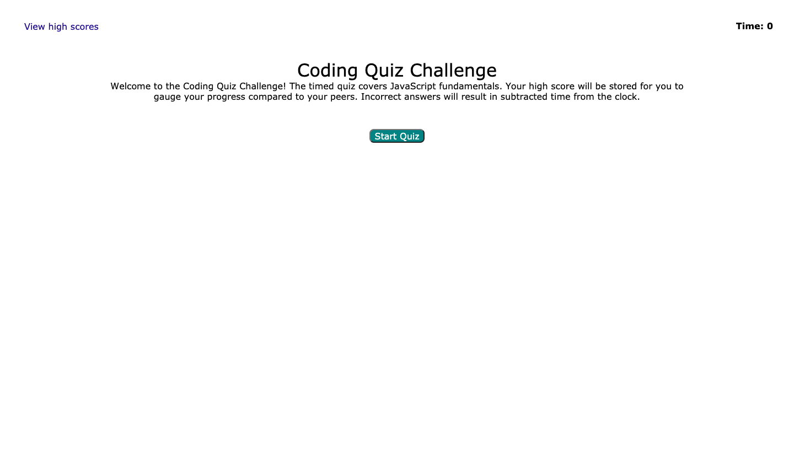
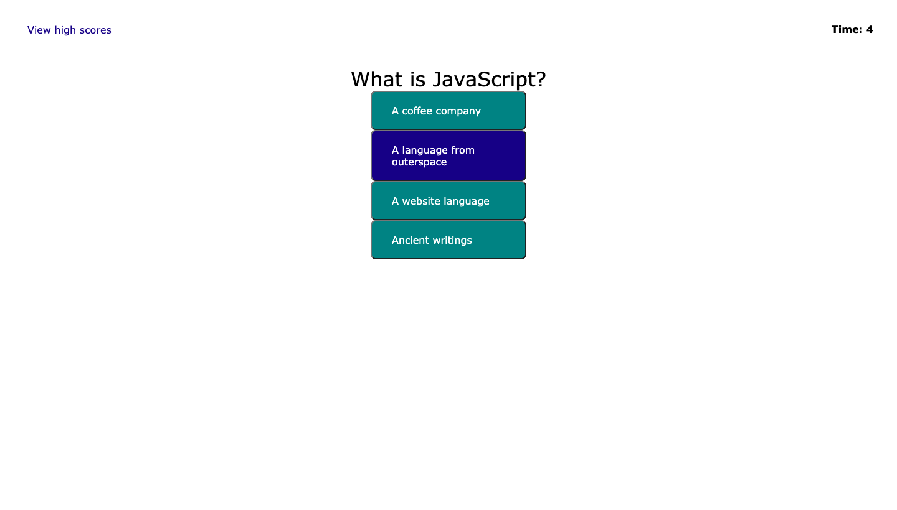

# code-quiz

## Motivation
My motivation for this project was in creating a multiple-choice, timed quiz that recorded the high scores for the users to compare against each other.

## What does the application do?
The application allows for the user to begin the quiz by clicking on a button. Once clicked, the timer and the quiz starts. If the user incorrectly answers, then the time is reduced. At the end of the quiz, the user can view their score and input their initials to be placed on the leader board.

## Languages Used
HTML, CSS, JavaScript

## Challenges
Challenges of the project were as follows: 
1. Ensuring that the timer functioned correctly.
2. Enabling the "View high-score" link.
3. Submitting initials into the leaderboard.

## Knowledge gained
I learned how to 'hide' elements in JS, use a timer with setInterval, add elements to HTML through JS, utilize localStorage, and create a multiple choice quiz.

## Contribution
I had help from TAs, course activities, and YouTube videos from Web Dev Simplified.

## Image
The following image shows the web application's appearance and functionality:

[Code Quiz Finished Project] (https://1jorcarver.github.io/code-quiz/)

